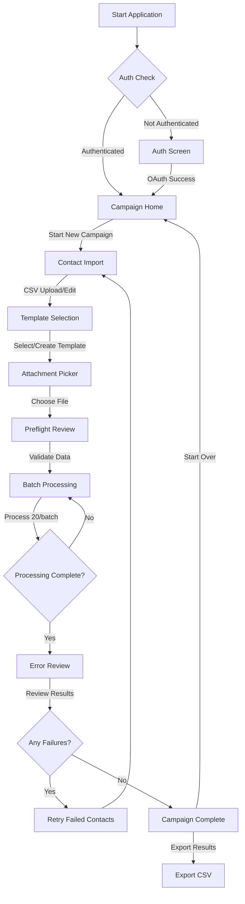
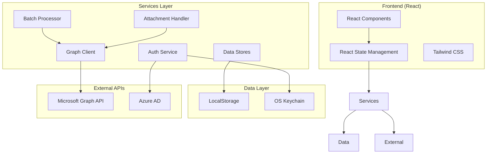
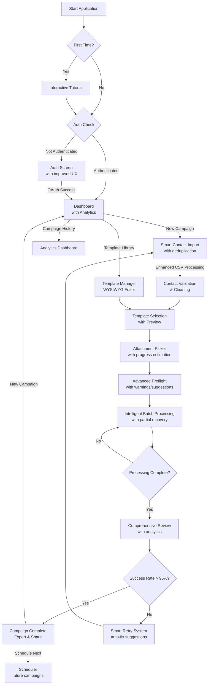
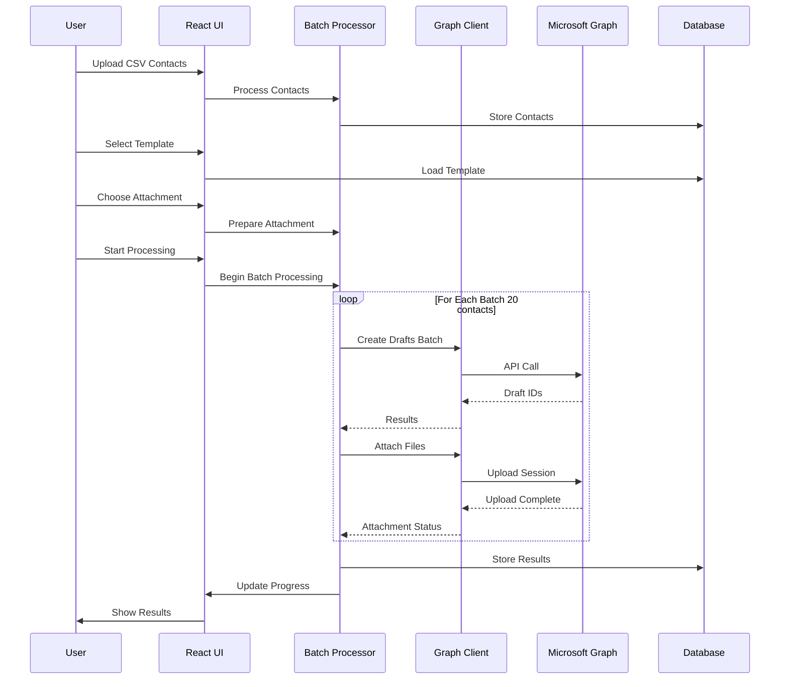
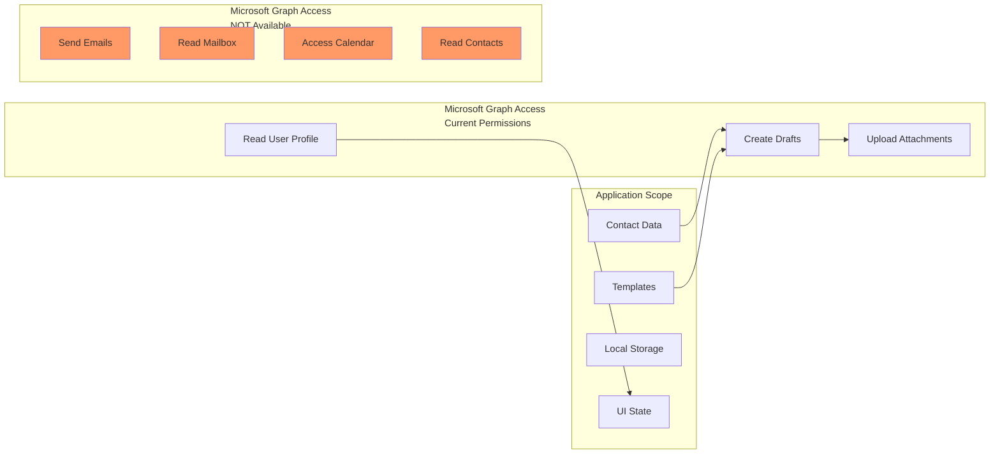
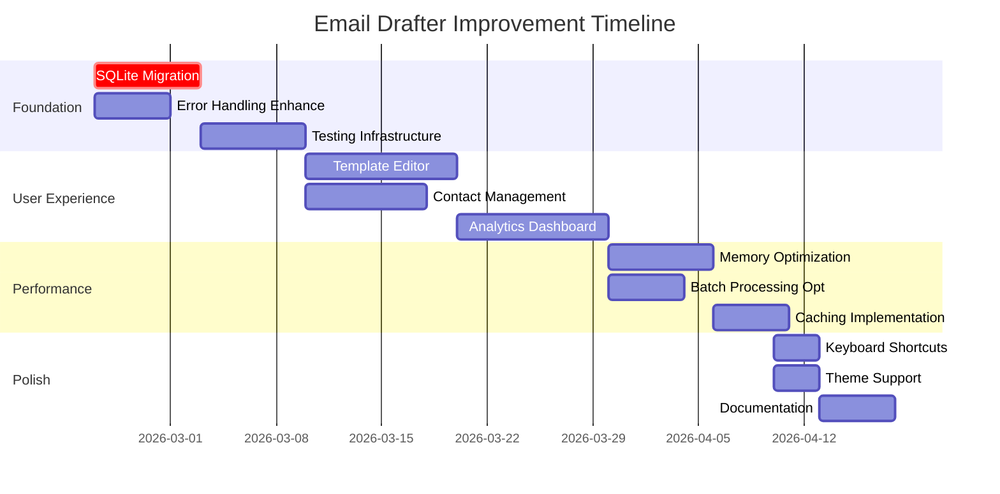

# Email Drafter - Application Workflow & Architecture

## Current Application Flow



## Current System Architecture



## Proposed Enhanced Workflow



## Data Flow Diagram



## Permission Boundary Diagram



## Improvement Implementation Sequence



## Key Decision Points

### 1. Database Migration Strategy
```
Option A: Gradual Migration
- Keep LocalStorage for existing data
- New data goes to SQLite
- Background migration process
- Risk: Data inconsistency

Option B: Big Bang Migration  
- One-time migration script
- Validate all data before cutover
- Risk: Migration failure

Recommended: Option B with rollback plan
```

### 2. Template Editor Technology
```
Option A: Tiptap (ProseMirror based)
- Pros: Extensible, good React support
- Cons: Larger bundle size

Option B: Draft.js (Facebook)
- Pros: Stable, good documentation
- Cons: Less active development

Option C: Custom simple editor
- Pros: Lightweight, full control
- Cons: More development time

Recommended: Option A (Tiptap) for balance
```

### 3. Error Recovery Strategy
```
Option A: Automatic retry with backoff
- Pros: Better user experience
- Cons: May hide underlying issues

Option B: Manual retry with analysis
- Pros: User learns from errors
- Cons: More user intervention

Option C: Hybrid approach
- Automatic for transient errors
- Manual for persistent errors

Recommended: Option C with clear error categorization
```

## Monitoring Points

### Application Health Checks
1. **Authentication Success Rate** (>95%)
2. **Draft Creation Success Rate** (>99%)
3. **Attachment Upload Success Rate** (>98%)
4. **Batch Processing Time** (<30 seconds per batch)
5. **Memory Usage** (<100MB for 10k contacts)

### User Experience Metrics
1. **Time to First Campaign** (<5 minutes)
2. **Template Creation Time** (<2 minutes)
3. **Error Recovery Time** (<1 minute)
4. **User Satisfaction Score** (>4/5)

### Technical Metrics
1. **API Call Latency** (p95 < 500ms)
2. **Database Query Performance** (<50ms)
3. **Bundle Size** (<5MB)
4. **Startup Time** (<3 seconds)

## Risk Assessment Matrix

| Risk | Probability | Impact | Mitigation Strategy |
|------|------------|--------|---------------------|
| Graph API rate limiting | High | Medium | Implement exponential backoff, queue management |
| Large file upload failure | Medium | High | Resumable uploads, chunk verification |
| Data migration failure | Low | High | Backup before migration, rollback plan |
| Memory leak with large datasets | Medium | High | Memory profiling, virtual scrolling |
| Authentication token expiry | High | High | Automatic refresh with buffer |
| LocalStorage data loss | Medium | High | SQLite migration priority |

## Conclusion

The current workflow is functional but has several areas for improvement. The proposed enhancements focus on:
1. **Data persistence** (migrating from LocalStorage to SQLite)
2. **User experience** (better editors, previews, analytics)
3. **Error resilience** (smarter retry and recovery)
4. **Performance** (optimized processing and memory usage)

The modular architecture allows for incremental improvements without major rewrites. Starting with the foundation (database migration and error handling) will provide the stability needed for subsequent user experience enhancements.