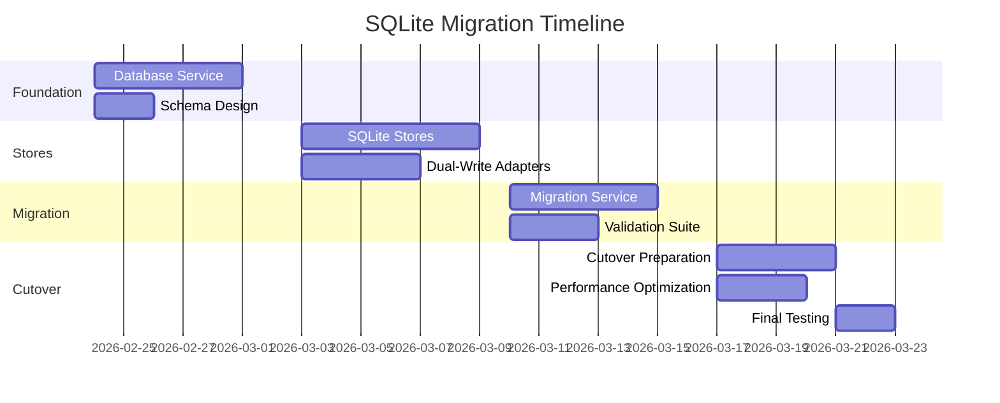

# SQLite Migration Implementation Plan

## Complete 4-Week Implementation Timeline

### Week 1: Foundation & Database Setup

#### Day 1-2: Database Service Creation
1. **Create `src/services/database.ts`**
   - SQLite connection management with better-sqlite3
   - WAL mode configuration for better concurrency
   - Schema initialization with proper tables
   - Backup/restore functionality

2. **Create database schema**
   - Templates table with versioning support
   - Campaigns table with status tracking
   - Messages table for individual email tracking
   - Events table for audit logging
   - Proper indexes for performance

#### Day 3-4: Basic CRUD Operations
1. **Implement query/execute methods**
   - Parameterized queries for security
   - Transaction support
   - Error handling and logging

2. **Create migration service skeleton**
   - Migration interface design
   - Data validation utilities
   - Rollback capabilities

#### Day 5: Testing Setup
1. **Create test database**
   - Unit tests for database service
   - Integration tests with sample data
   - Performance benchmarks

### Week 2: Store Implementation & Dual-Write

#### Day 6-7: SQLite Project Store
1. **Create `src/services/sqliteProjectStore.ts`**
   - Implement full ProjectStore interface
   - Template CRUD operations
   - Project snapshot management
   - Versioning support

2. **Create `src/services/sqliteCampaignStore.ts`**
   - Campaign CRUD operations
   - Message tracking
   - Analytics queries in SQL
   - Export functionality

#### Day 8-9: Dual-Write Adapters
1. **Create `src/services/dualWriteProjectStore.ts`**
   - Write to both LocalStorage and SQLite
   - Read from SQLite when available
   - Fallback to LocalStorage on error
   - Configuration flag to switch between stores

2. **Create `src/services/dualWriteCampaignStore.ts`**
   - Same dual-write pattern for campaigns
   - Data consistency validation
   - Conflict resolution

#### Day 10: Integration Testing
1. **Update application to use dual-write stores**
   - Modify imports in `src/App.tsx`
   - Update service initialization
   - Test with existing data

2. **Create validation scripts**
   - Compare LocalStorage vs SQLite data
   - Count record validation
   - Sample data comparison

### Week 3: Migration & Validation

#### Day 11-12: Migration Service Completion
1. **Complete `src/services/migrationService.ts`**
   - Full data migration from LocalStorage
   - Template migration with version preservation
   - Campaign and message migration
   - Error handling and resume capability

2. **Create migration UI component**
   - Progress indicator
   - Error reporting
   - User confirmation

#### Day 13: Data Validation Suite
1. **Create comprehensive validation**
   - Record count verification
   - Data integrity checks
   - Foreign key validation
   - Performance comparison

2. **Create backup/restore utilities**
   - LocalStorage backup before migration
   - SQLite backup after migration
   - Rollback procedure

#### Day 14-15: User Testing
1. **Test migration with real data**
   - Small dataset testing
   - Large dataset testing
   - Edge case testing (malformed data)

2. **Performance benchmarking**
   - Read performance comparison
   - Write performance comparison
   - Memory usage analysis

### Week 4: Cutover & Optimization

#### Day 16-17: Cutover Preparation
1. **Create cutover script**
   - One-way migration finalization
   - LocalStorage archival
   - SQLite optimization

2. **Update all services to use SQLite only**
   - Remove dual-write code
   - Update imports to use SQLite stores
   - Remove LocalStorage dependencies

#### Day 18-19: Performance Optimization
1. **Database optimization**
   - Index tuning
   - Query optimization
   - Connection pooling
   - Cache implementation

2. **Create maintenance utilities**
   - Database vacuum tool
   - Backup scheduler
   - Integrity checker

#### Day 20: Final Testing & Documentation
1. **Comprehensive testing**
   - Unit tests for all new services
   - Integration tests for migration
   - End-to-end workflow testing

2. **Documentation**
   - Update README with new architecture
   - Create migration guide for users
   - Add troubleshooting section

## Detailed Task Breakdown

### Task 1: Database Service (8 hours)
```typescript
// Files to create:
// src/services/database.ts
// src/services/database.types.ts
// src/__tests__/database.test.ts

// Key features:
// - Singleton pattern for database connection
// - WAL mode configuration
// - Transaction support
// - Backup/restore methods
// - Connection pooling for Electron
```

### Task 2: Schema Design (4 hours)
```sql
-- Complete schema including:
-- 5 main tables with proper relationships
-- 8 indexes for performance
-- Foreign key constraints
-- Timestamp columns for auditing
```

### Task 3: SQLite Stores (12 hours)
```typescript
// Files to create:
// src/services/sqliteProjectStore.ts
// src/services/sqliteCampaignStore.ts
// src/services/sqliteContactStore.ts (optional future)

// Each store must:
// - Implement existing store interfaces
// - Convert JSON data to relational model
// - Handle SQLite-specific error cases
// - Include comprehensive logging
```

### Task 4: Dual-Write Adapters (8 hours)
```typescript
// Files to create:
// src/services/dualWriteProjectStore.ts
// src/services/dualWriteCampaignStore.ts

// Key functionality:
// - Write to both storage systems
// - Read from primary (configurable)
// - Automatic failover on errors
// - Data consistency validation
```

### Task 5: Migration Service (10 hours)
```typescript
// Files to create:
// src/services/migrationService.ts
// src/components/MigrationWizard.tsx
// src/utils/migrationValidator.ts

// Features:
// - One-time migration from LocalStorage
// - Progress reporting
// - Error recovery
// - Rollback capability
// - Validation reporting
```

### Task 6: Backup System (6 hours)
```typescript
// Files to create:
// src/services/backupService.ts
// scripts/backup.js (CLI tool)
// scripts/restore.js (CLI tool)

// Features:
// - Scheduled backups (daily/weekly)
// - Compression and encryption
// - Cloud storage integration (optional)
// - Restore procedure
```

### Task 7: Performance Optimization (8 hours)
```typescript
// Tasks:
// - Query optimization analysis
// - Index creation based on usage patterns
// - Connection pooling implementation
// - Memory usage optimization
// - Caching layer for frequent queries
```

### Task 8: Testing Suite (10 hours)
```typescript
// Test files to create:
// src/__tests__/sqliteProjectStore.test.ts
// src/__tests__/migrationService.test.ts
// src/__tests__/integration/database.test.ts
// e2e/migration.test.ts

// Test coverage goals:
// - 90%+ coverage for new services
// - Integration tests for migration
// - Performance regression tests
// - Data integrity tests
```

### Task 9: Documentation & User Guide (4 hours)
```markdown
// Documentation to create/update:
// docs/database-migration.md
// docs/backup-restore.md
// docs/troubleshooting.md
// Update README.md with new features
```

## Risk Mitigation Plan

### Risk 1: Data Loss During Migration
**Mitigation:**
- Implement dual-write during migration phase
- Create LocalStorage backup before migration
- Provide rollback procedure
- Validate data after migration

### Risk 2: Performance Regression
**Mitigation:**
- Performance benchmarking before/after
- Query optimization during implementation
- Index creation based on actual usage
- Caching for frequent queries

### Risk 3: Migration Failure
**Mitigation:**
- Incremental migration (table by table)
- Resume capability if interrupted
- Detailed error logging
- User-friendly error messages

### Risk 4: Database Corruption
**Mitigation:**
- Regular automated backups
- Database integrity checks
- WAL mode for crash safety
- Checksum verification

## Success Criteria

### Technical Success Criteria
1. **Data Integrity**: 100% of LocalStorage data successfully migrated
2. **Performance**: SQLite queries perform equal or better than LocalStorage
3. **Reliability**: No data loss during cutover
4. **Maintainability**: Clean code with 90%+ test coverage

### User Success Criteria
1. **Transparency**: Users unaware of migration (no downtime)
2. **Performance**: Application feels faster or equal speed
3. **Features**: All existing functionality preserved
4. **Recovery**: Easy backup/restore available

### Business Success Criteria
1. **Cost**: Zero additional infrastructure cost
2. **Scalability**: Supports 10x current data volume
3. **Maintenance**: Reduced support requests for data loss
4. **Future-proof**: Ready for multi-user features

## Rollback Plan

### If Migration Fails:
1. **Immediate Rollback** (Day 1-14):
   - Switch back to LocalStorage stores
   - Use LocalStorage backup
   - Log migration errors for analysis

2. **Data Recovery**:
   - Restore from LocalStorage backup
   - Validate recovered data
   - Continue using LocalStorage until issues resolved

3. **Post-Mortem**:
   - Analyze failure cause
   - Fix issues in migration code
   - Schedule new migration attempt

## Monitoring & Metrics

### During Migration:
1. **Progress Tracking**:
   - Records migrated per second
   - Error rate
   - Memory usage

2. **Performance Metrics**:
   - Query response times
   - Write throughput
   - Database file size growth

### Post-Migration:
1. **Operational Metrics**:
   - Daily backup success rate
   - Database integrity check results
   - User-reported issues

2. **Performance Metrics**:
   - 95th percentile query times
   - Concurrent connection count
   - Disk I/O patterns

## Resource Requirements

### Development Resources:
- **Time**: 4 weeks (160 hours) for one developer
- **Skills**: TypeScript, SQLite, Electron, React
- **Tools**: Existing development environment

### Infrastructure Resources:
- **Storage**: Additional ~100MB disk space for database
- **Memory**: Minimal increase (<50MB)
- **CPU**: Negligible impact

### Testing Resources:
- **Test Data**: Sample datasets of various sizes
- **Testing Environment**: Isolated test database
- **Performance Tools**: SQLite profiling tools

## Dependencies

### Internal Dependencies:
1. **better-sqlite3**: Already in package.json
2. **Existing Store Interfaces**: Must maintain compatibility
3. **Electron APIs**: For file system access

### External Dependencies:
1. **Node.js**: Already required
2. **File System**: Read/write permissions
3. **Backup Storage**: Local disk or cloud (optional)

## Deliverables

### Code Deliverables:
1. Complete database service with tests
2. SQLite implementations of all stores
3. Migration service with UI component
4. Backup/restore utilities
5. Updated application using SQLite

### Documentation Deliverables:
1. Updated architecture documentation
2. Migration guide for users
3. Backup/restore procedures
4. Troubleshooting guide

### Operational Deliverables:
1. Automated backup system
2. Database maintenance scripts
3. Monitoring dashboards (optional)
4. Performance benchmarks

## Timeline Visualization



## Conclusion

This implementation plan provides a safe, incremental approach to migrating from LocalStorage to SQLite. The 4-week timeline allows for thorough testing and validation at each step, minimizing risk while delivering a robust, production-ready database solution.

The dual-write approach ensures no data loss during migration, and the comprehensive testing suite guarantees data integrity. The result will be a more reliable, scalable, and maintainable data storage layer for the Email Drafter application.